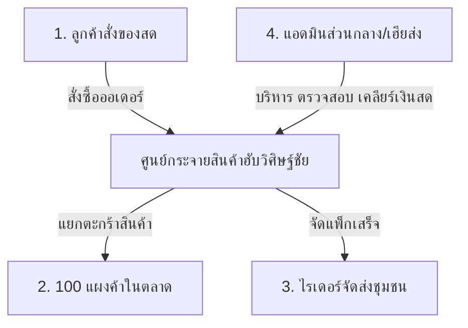

# 📖 คู่มือระบบและบันทึกการพัฒนาเชิงลึก (System Walkthrough & Operations Manual)
**โครงการ:** ตลาดฮับวิศิษฐ์ชัย (TalatHub Wisitchai Fresh Market)  
**คลังโค้ด:** [github.com/pisaen666/hsong](https://github.com/pisaen666/hsong)  
**เวอร์ชันปัจจุบัน:** `v=9.0`  
**อัปเดตล่าสุด:** 7 กันยายน 2026  

---

## 📑 สารบัญ (Table of Contents)
1. [ภาพรวมสถาปัตยกรรมระบบ (System Architecture & 5 Roles)](#1-ภาพรวมสถาปัตยกรรมระบบ-system-architecture--5-roles)
2. [ระบบพิมพ์สลิปความร้อน 80x80mm & ใบสรุป A4](#2-ระบบพิมพ์สลิปความร้อน-80x80mm--ใบสรุป-a4)
3. [การปรับแต่ง Responsive & ป้องกัน Viewport ล้นบนมือถือ](#3-การปรับแต่ง-responsive--ป้องกัน-viewport-ล้นบนมือถือ)
4. [ศูนย์บริหารจัดการส่วนกลาง (Admin Console - 5 หมวดหมู่)](#4-ศูนย์บริหารจัดการส่วนกลาง-admin-console---5-หมวดหมู่)
   - [หมวดที่ 1: รายงานประจำวัน & เคลียร์เงิน](#หมวดที่-1-รายงานประจำวัน--เคลียร์เงิน-daily-operations--settlements)
   - [หมวดที่ 2: สถิติภาพรวม & ยอดสะสม](#หมวดที่-2-สถิติภาพรวม--ยอดสะสม-overview-analytics)
   - [หมวดที่ 3: จัดการ 100 แผงค้า & พร้อมเพย์](#หมวดที่-3-จัดการ-100-แผงค้า--พร้อมเพย์-stalls-directory--promptpay)
   - [หมวดที่ 4: บริหารงานไรเดอร์ & เรดาร์ GPS สด (ฟีเจอร์หลัก)](#หมวดที่-4-บริหารงานไรเดอร์--เรดาร์-gps-สด-riders-fleet-operations)
   - [หมวดที่ 5: ตั้งค่าระบบฮับ & ระเบียบปฏิบัติ 4 บทบาท](#หมวดที่-5-ตั้งค่าระบบฮับ--ระเบียบปฏิบัติ-4-บทบาท-hub-settings)
5. [คู่มือตั้งค่าไดรเวอร์เครื่องพิมพ์ความร้อนใน Windows](#5-คู่มือตั้งค่าไดรเวอร์เครื่องพิมพ์ความร้อนใน-windows)
6. [โครงสร้างไฟล์และจุดแก้ไขสำคัญในโค้ด](#6-โครงสร้างไฟล์และจุดแก้ไขสำคัญในโค้ด)
7. [ระบบป้ายแบนเนอร์ประชาสัมพันธ์ & การจัดระเบียบแถบหัวเว็บมือถือ](#7-ระบบป้ายแบนเนอร์ประชาสัมพันธ์-3-banners--การจัดระเบียบแถบหัวเว็บมือถือ-v69)

---

## 1. ภาพรวมสถาปัตยกรรมระบบ (System Architecture & 5 Roles)

ระบบตลาดฮับวิศิษฐ์ชัยถูกออกแบบเป็น **Single Page Application (SPA)** ที่รวมทุกบทบาทการใช้งานของชุมชนตลาดสดไว้ในระบบเดียว:



* **Role 1: ลูกค้า (Customer)**: คัดสรรสินค้าสดจาก 100 แผงค้า รวมออเดอร์ในตะกร้าเดียว ค่าส่งเหมาจ่าย คำนวณระยะทางจากตลาด
* **Role 2: ฮับจัดของ (Hub Packer)**: ตรวจสอบ Picking List แยกตะกร้าตามแผงค้า ติดสติกเกอร์รหัสออเดอร์ ชั่งน้ำหนักจริง
* **Role 3: แผงค้า (Merchant)**: 100 แผงค้าเปิดหน้าร้าน รับออเดอร์ จัดเตรียมของสด ชั่งน้ำหนัก และรับเงินโอนพร้อมเพย์ 0% GP
* **Role 4: ไรเดอร์ (Rider)**: รับงานจัดส่งสินค้า นำทาง GPS เก็บเงินสดปลายทาง (COD) และนำส่งยอดเคลียร์เงินที่ฮับ
* **Role 5: แอดมินส่วนกลาง (Super Admin)**: ศูนย์ควบคุมแบบ Widescreen บน PC และ Responsive บนมือถือ ควบคุมการเงิน สถิติ แผงค้า ไรเดอร์ และการตั้งค่าระบบ

---

## 2. ระบบพิมพ์สลิปความร้อน 80x80mm & ใบสรุป A4

### ปัญหาที่เกิดขึ้นจริงและแนวทางแก้ไข
1. **ปัญหากระดาษไหลยาวเกินไป (Blank Paper Waste)**:
   - เครื่องพิมพ์สลิปความร้อน (Thermal POS Printer เช่น Epson TM-T82, Xprinter, POS-80) เมื่อสั่งพิมพ์ผ่านเว็บเบราว์เซอร์ มักจะตั้งค่าหน้ากระดาษเริ่มต้นเป็นขนาด Roll Paper ยาว 297mm ทำให้กระดาษไหลเปล่าออกมาเป็นฟุตก่อนจะตัด
2. **ปัญหาสลิปเลื่อนไปอยู่กึ่งกลางหน้ากระดาษ (Centered Alignment)**:
   - สลิปขนาดเล็กถูกสั่งพิมพ์ด้วยค่ามาตรฐานของเบราว์เซอร์ที่มีการใส่ Margin ซ้าย-ขวา ทำให้เนื้อหาขยับไปอยู่ตรงกลาง ดูไม่ชิดขอบแบบใบเสร็จมาตรฐาน
3. **การหาฟังก์ชัน Paper Cut / Paper Reduction ไม่เจอใน Windows**:
   - ไดรเวอร์ Windows บางรุ่นไม่มีเมนูตั้งค่าการตัดกระดาษแบบกำหนดเองจากหน้าตั้งค่าเครื่องพิมพ์

### โซลูชันเทคนิคที่พัฒนาในระบบ (`app.js` & `styles.css`)
* **Dynamic Slip Height Calculation (คำนวณความสูงกระดาษตามเนื้อหาจริง)**:
  ระบบจะนับความยาวของตัวอักษรและจำนวนบรรทัดของสลิปแบบ Real-time แล้วกำหนดความสูงกระดาษให้พอดีกับเนื้อหา:
  ```javascript
  const contentLen = contentHtml.length;
  const autoHeightMm = Math.max(70, Math.ceil((contentLen / 12) * 4.2) + 45);
  ```
* **CSS Page Definition**:
  กำหนดขอบเขตหน้ากระดาษให้แนบสนิท ไม่เหลือพื้นที่ว่างด้านล่าง:
  ```css
  @page {
      size: 72mm ${autoHeightMm}mm;
      margin: 0;
  }
  ```
* **Top-Left Safe Alignment (ความกว้างปลอดภัย 68mm)**:
  ```css
  body.thermal-mode {
      width: 100% !important;
      max-width: 68mm !important;
      margin: 0 !important;
      padding: 2mm 3mm 4mm 3mm !important;
      text-align: left !important;
  }
  ```
* **แยกปุ่มพิมพ์ 2 รูปแบบ**:
  * **ปุ่มสลิปความร้อน 80x80mm**: ประจำอยู่ท้ายทุกรายการ (รายร้านค้า, รายไรเดอร์) สำหรับฉีกให้เป็นใบเสร็จรับเงิน
  * **ปุ่มพิมพ์ใบสรุป A4**: จัดวางกึ่งกลางที่ด้านล่างของแต่ละหมวดรายงาน (หมวด 2-4) สำหรับฝ่ายบัญชีดูภาพรวมทั้งวัน

---

## 3. การปรับแต่ง Responsive & ป้องกัน Viewport ล้นบนมือถือ

### ปัญหาที่พบเมื่อเปิด Admin Console บนมือถือ
* เมื่อกดเข้าสู่โหมดแอดมินบนจอมือถือ หน้าจอเกิดการล้นแนวนอน (Viewport Blowout) ต้องเลื่อนซ้าย-ขวา และเกิดแถบขาวว่างด้านข้าง เนื่องจากตารางและกล่องหัวเรื่องมีขนาดความกว้างแบบคงที่ (Fixed Width)

### แนวทางแก้ไขที่ติดตั้งแล้ว
1. **ล็อกไม่ให้เกิดการเลื่อนหลุดหน้าจอ (No Horizontal Scroll)**:
   ใน [`styles.css`](file:///c:/pisaen/hsong/styles.css):
   ```css
   html, body {
       overflow-x: hidden;
       max-width: 100vw;
       width: 100%;
       margin: 0;
       padding: 0;
   }
   ```
2. **การใส่ `min-w-0` ให้ Flexbox & Grid Items**:
   ใน Tailwind CSS เมื่อ element ลูกมีเนื้อหายาว เบราว์เซอร์จะไม่ยอมย่อขนาด การใส่ `min-w-0` บังคับให้ข้อความตัดคำ (`truncate`) และไม่ดัน layout ให้บวม
3. **แถบเมนูนำทางแบบปัดได้ (Horizontal Scrollable Tabs)**:
   แถบสลับ 5 แท็บแอดมินรองรับการปัดนิ้วบนมือถือ พร้อมซ่อน scrollbar ให้ดูเหมือนแอปพลิเคชันพื้นฐาน (`overflow-x-auto max-w-full scrollbar-none`)

---

## 4. ศูนย์บริหารจัดการส่วนกลาง (Admin Console - 5 หมวดหมู่)

### หมวดที่ 1: รายงานประจำวัน & เคลียร์เงิน (Daily Operations & Settlements)
* **สรุปยอดขาย Realtime**: คำนวณยอดขายรวม (GMV), สัดส่วนการชำระเงิน (โอนพร้อมเพย์ vs เงินสด COD)
* **เคลียร์เงินร้านค้า 100 แผง**: แสดงยอดที่ต้องโอนให้แต่ละแผงค้า พร้อมปุ่มเปิด QR Code โอนเงินตรงเข้าบัญชีพร้อมเพย์แม่ค้า และปุ่มพิมพ์สลิป 80mm
* **สรุปการส่งมอบเงินไรเดอร์**: ตรวจสอบว่าไรเดอร์คนใดนำส่งเงินสด COD เข้าฮับแล้วหรือยังค้างส่ง

### หมวดที่ 2: สถิติภาพรวม & ยอดสะสม (Overview Analytics)
* แดชบอร์ดสรุปตัวเลขอัตราการเติบโต:
  * ยอดขายสะสมทั้งหมดในระบบ
  * อัตราการจัดส่งสำเร็จ (Order Completion Rate %)
  * ยอดสั่งซื้อเฉลี่ยต่อบิล (Average Order Value - AOV)
  * ค่าจัดส่งรวมสะสม

### หมวดที่ 3: จัดการ 100 แผงค้า & พร้อมเพย์ (Stalls Directory & PromptPay)
* สารบัญ 100 แผงค้าในตลาดสดวิศิษฐ์ชัย แยกตามโซน A (ไก่/เนื้อ), โซน B (ผักสด), โซน C (เครื่องแกง), โซน E (อาหารทะเล)
* ปุ่มทดสอบสร้าง QR Code พร้อมเพย์ตามเบอร์โทรศัพท์ของเจ้าของแผงจริง พร้อมพิมพ์สลิปยืนยันการจ่ายเงิน

### หมวดที่ 4: ศูนย์บริหารงานไรเดอร์ชุมชน & ค่ารอบจัดส่ง (Fleet Operations)
> 🚀 **จัดระเบียบ 4 แท็บย่อยระดับปฏิบัติการ & ระบบพิมพ์อัจฉริยะ (v=9.0)**

ระบบได้รับการจัดโครงสร้างแยกเป็น **4 แท็บย่อย (Sub-Tabs)** พร้อมติดตั้งปุ่มพิมพ์ที่ตรงกับการใช้งานจริง (สลิป 80mm vs กระดาษ A4):

1. **แท็บย่อยที่ 1: 📡 มอนิเตอร์สด & เรดาร์ GPS (Live Radar & Fleet Operations)**
   * **4 การ์ด Live KPIs สด**: จำนวนไรเดอร์ในระบบ (ว่าง/วิ่ง/พัก), รอบส่งสำเร็จวันนี้, เงินสด COD ค้างในมือรวม, และปุ่มเปิดโหมดฝนตก 🌧️
   * **เรดาร์แผนที่ไรเดอร์สด Leaflet GPS Map**: แสดงหมุดฮับตลาดวิศิษฐ์ชัย และหมุดไรเดอร์แยกสีสด (🟢 พร้อม, 🟡 ส่งของ, 🔴 พัก)
   * **รายชื่อคนขับพร้อมสลับสถานะ 1-Click**: มีปุ่มลัด `[⚡ จ่ายงานด่วน]`, `[🛵 เข้าสู่ระบบรับงาน]`, `[🧾 สลิปงาน 80mm]`, และ `[💵 เคลียร์ COD]`

2. **แท็บย่อยที่ 2: 📋 ทำเนียบคนขับ & คัดเลือกใบสมัคร (Fleet Roster & HR Applications)**
   * **สลับดู 2 มุมมอง (Segment Switch)**:
     * `[ 👥 ทำเนียบไรเดอร์ประจำตลาด ]`: แสดงข้อมูลรถ, ทะเบียน, เบอร์โทร, พร้อมเพย์, โซนวิ่ง, แก้ไข, ลบ, และ **ปุ่ม `[📄 พิมพ์ทำเนียบ A4]`** สำหรับเก็บเข้าแฟ้ม
     * `[ 📑 ใบสมัครร่วมทีมไรเดอร์ ]`: มีแถบกรอง (ทั้งหมด / รออนุมัติ / อนุมัติแล้ว / ปฏิเสธ) พร้อม **ปุ่ม `[📄 พิมพ์ใบสมัคร A4]`** พิมพ์ประวัติผู้สมัครฉบับเต็มพร้อมช่องลงนามอนุมัติ
   * **ปุ่ม `[+ เพิ่มไรเดอร์ใหม่]`** และ **`[📝 ฟอร์มสมัครไรเดอร์]`** เปิด Modal กรอกข้อมูลทันที

3. **แท็บย่อยที่ 3: 💰 เคลียร์เงิน COD & บัญชีค่ารอบ (COD Settlements & Payouts)**
   * **แดชบอร์ดเฝ้าระวังเงินสด COD ในมือ**: แจ้งเตือนสีแดงกะพริบทันทีหากมีไรเดอร์ถือเงินสดเกินเพดาน ฿2,500
   * **ปุ่มมาสเตอร์ `[💸 สรุปจ่ายค่ารอบพร้อมเพย์]`**: เปิด QR Code พร้อมเพย์โอนค่ารอบให้คนขับแบบ 0% GP
   * **ปุ่มมาสเตอร์ `[📄 พิมพ์สรุป A4 (ส่งบัญชี)]`**: พิมพ์สรุปบัญชีรอบวิ่งและการเงินของไรเดอร์ทุกคนสำหรับส่งฝ่ายบัญชีและเซ็นรับเงิน
   * **ระบบรายคน**: ปุ่ม `[💵 เคลียร์เงิน COD]` รับเงินสดเข้าฮับ และปุ่ม `[🧾 สลิป 80mm]` ฉีกสลิปความร้อนให้ไรเดอร์เก็บไว้เป็นหลักฐาน

4. **แท็บย่อยที่ 4: ⚙️ ตั้งค่าค่ารอบ & กฎโบนัส (Rates, Bonus & Weather Rules)**
   * **ปุ่ม `[📄 พิมพ์ระเบียบ A4 ติดบอร์ด]`**: พิมพ์โครงสร้างค่ารอบและระเบียบปฏิบัติ 5 ข้อ เพื่อติดบอร์ดประกาศในห้องพักไรเดอร์
   * **สวิตช์ฝนตก 1-Click (`🌧️`)**: เปิดโหมดสภาพอากาศรุนแรง เพิ่มเบี้ยเลี้ยงพิเศษ (+฿15/เที่ยว หรือตามกำหนด) ทันที
   * ปรับค่ารอบมาตรฐาน (฿/เที่ยว), เป้าหมายโบนัสความขยัน (เช่น วิ่งครบ 10 เที่ยว +฿100), และเพดานเงินสด COD สูงสุด (฿2,500)

### หมวดที่ 5: ตั้งค่าระบบฮับ & ระเบียบปฏิบัติ 4 บทบาท (Hub Settings)
* ปรับแต่งข้อความคู่มือและระเบียบปฏิบัติ 4 ฝ่าย:
  1. ประกาศถึงลูกค้า
  2. ระเบียบฝ่ายจัดเตรียมสินค้า (ฮับ)
  3. ข้อตกลงสำหรับ 100 แผงค้า
  4. ระเบียบวินัยไรเดอร์
* ตั้งค่ายอดสั่งซื้อขั้นต่ำ, ค่าจัดส่งเริ่มต้น, รหัสคูปองส่วนลด, รหัส PIN พนักงาน

---

## 5. คู่มือตั้งค่าไดรเวอร์เครื่องพิมพ์ความร้อนใน Windows

สำหรับการพิมพ์สลิป 80x80mm ให้ได้ผลลัพธ์สวยงามและตัดกระดาษพอดีที่สุด แนะนำให้ตรวจสอบการตั้งค่าใน Windows ดังนี้:

1. **เข้าเมนูเครื่องพิมพ์ใน Windows**:
   - กดปุ่ม `Windows + R` พิมพ์ `control printers` แล้วกด Enter
   - คลิกขวาที่เครื่องพิมพ์ใบเสร็จ (เช่น Epson TM-T82 หรือ POS-80) เลือก **Printing preferences (การกำหนดลักษณะการพิมพ์)**
2. **การตั้งค่าขนาดกระดาษ (Paper Size)**:
   - เลือกเป็น **Roll Paper 80 x 297 mm** หรือ **80 x 70 mm** (หากมี)
3. **การตั้งค่าระยะตัดกระดาษ (Paper Cut / Feed Options)**:
   - มองหาแท็บ **Document Settings** หรือ **Operation / Feeding**
   - หัวข้อ **Cut Type**: เลือกเป็น **Auto Cut (Partial Cut)**
   - หัวข้อ **Feed to Tear-off / Cut Position**: ให้เลือก **Yes** หรือกำหนด Extra Feed เป็น `0 mm` หรือ `minimum` เพื่อไม่ให้เครื่องป้อนกระดาษเปล่าออกมาเกินจำเป็น
4. **ในหน้าต่าง Print Preview ของ Google Chrome / Edge**:
   - **Destination**: เลือกชื่อเครื่องพิมพ์ความร้อน
   - **Paper size**: เลือกขนาดกระดาษความร้อนที่ตั้งไว้
   - **Margins**: เลือกเป็น **None (ไม่มี)** เสมอ
   - **Scale**: เลือกเป็น **Default** หรือ `100%`
   - **Options**: ติ๊กเลือก **Background graphics (กราฟิกพื้นหลัง)**

---

## 6. โครงสร้างไฟล์และจุดแก้ไขสำคัญในโค้ด

| ชื่อไฟล์ | บทบาทหลัก | ฟังก์ชันและจุดแก้ไขสำคัญ |
|---|---|---|
| [`index.html`](file:///c:/pisaen/hsong/index.html) | โครงสร้างหน้าเว็บหลักและ Modal ทั้งหมด | โครงสร้าง Top Header จัดระเบียบบนมือถือ (บรรทัด ~57), แบนเนอร์โฆษณา Hero Carousel (`#hero-banner-carousel-container`), เวอร์ชันสคริปต์ `app.js?v=6.9` |
| [`app.js`](file:///c:/pisaen/hsong/app.js) | ตรรกะการทำงาน (Business Logic) และข้อมูล | ฟังก์ชัน Hero Banner Carousel (`goToHeroBannerSlide`, `nextHeroBannerSlide`, `prevHeroBannerSlide`, `handleHeroBannerClick`, `initHeroBannerCarousel`), `renderAuthHeaderButtons` |
| [`styles.css`](file:///c:/pisaen/hsong/styles.css) | การจัดสไตล์และ CSS สำหรับการพิมพ์ | สไตล์ปุ่มจุด Indicator แบนเนอร์ (`.hero-dot`, `.hero-dot.active`), การจัดเลย์เอาต์การพิมพ์และ responsive |
| `images/` | โฟลเดอร์รูปภาพแบนเนอร์โฆษณา | `banner_1.jpg` (ตลาดสดพรีเมี่ยม), `banner_2.jpg` (เฮียส่งส่งด่วน), `banner_3.jpg` (คูปอง WELCOMESONG) |
| [`server.js`](file:///c:/pisaen/hsong/server.js) | เว็บเซิร์ฟเวอร์ Node.js ในพื้นที่ | รันเซิร์ฟเวอร์พอร์ต 3000 สำหรับการทดสอบในเครื่อง |

---

## 7. ระบบป้ายแบนเนอร์ประชาสัมพันธ์ (3 Banners) & การจัดระเบียบแถบหัวเว็บมือถือ (v=6.9)

### 1. การจัดระเบียบปุ่มหัวเว็บ (Clean Top Navbar):
* **แถวที่ 1 (บนมือถือ)**: รวมโลโก้ "เฮียส่ง" (ซ้าย) เข้ากับชุดปุ่มเข้าสู่ระบบแบบกระชับ (ขวา) ได้แก่ `[ลูกค้า]`, `[ร้านค้า]`, `[Admin]`, และ `[🖥️]` อยู่ในแถวเดียวกันอย่างลงตัว ไม่ดันจนตกบรรทัด
* **แถวที่ 2 (บนมือถือ)**: แถบสลับ 4 บทบาทหลัก (`#main-role-selector-bar`) ถูกปรับเป็น **Segmented Control 4 ช่องเท่ากัน (`grid grid-cols-4`)**:
  `[ 🛒 1.ลูกค้า ]` `[ 📦 2.จัดส่ง ]` `[ 🏪 3.แผงค้า ]` `[ 🛵 4.ไรเดอร์ ]`
  ไม่มีการตัดคำตกบรรทัด ความสูงกะทัดรัด สะอาด สวยงามแบบแอปพลิเคชันมือถือระดับพรีเมียม

### 2. ระบบสลับป้ายแบนเนอร์ประชาสัมพันธ์ (Auto-Slide Hero Carousel):
* นำภาพโฆษณาความละเอียดสูงสัดส่วน 16:9 ทั้ง 3 รูปมาแสดงผลแบบ Carousel เต็มความกว้าง
  * **ป้ายที่ 1 (`images/banner_1.jpg`)**: *ตลาดสดพรีเมี่ยม ส่งตรงถึงบ้านคุณ* (คลิกเพื่อเลื่อนลงไปดู 100 แผงค้า)
  * **ป้ายที่ 2 (`images/banner_2.jpg`)**: *เฮียส่ง..ส่งตรง จากตลาดวิศิษฐ์ชัย ถึงมือคุณ รวดเร็ว ทันใจ* (คลิกเพื่อเปิดแผนที่เช็กจุดส่ง 30 นาที)
  * **ป้ายที่ 3 (`images/banner_3.jpg`)**: *คูปองส่วนลดพิเศษ WELCOMESONG ส่งฟรี* (คลิกเพื่อรับสิทธิ์และคัดลอกโค้ดลดค่าส่ง)
* **ฟังก์ชันการทำงาน**:
  * หมุนเปลี่ยนป้ายอัตโนมัติทุก 4.5 วินาที พร้อมหยุดชั่วคราวเมื่อแตะสัมผัส (Touch/Hover Pause)
  * รองรับการปัดนิ้วซ้าย-ขวาบนจอมือถือ (Touch Swipe Gesture)
  * จุด Indicator 3 จุดด้านล่าง เปลี่ยนรูปร่างเป็นแคปซูลสีเขียวมรกตเรืองแสงตามสไลด์ที่กำลังแสดง
  * ปุ่มลูกศรซ้าย-ขวาแบบกระจกใส (Glassmorphism) สำหรับกดเลื่อนเอง

---

## 8. ระบบแผงค้าเรียกไรเดอร์ส่งของด่วน & ปฏิบัติการ 5 ปุ่มใช้งานได้จริง 100% (v=9.9)

### 1. สถาปัตยกรรมและกระบวนการทำงาน 3 สเต็ป (3-Step Dispatch Workflow):
* **ขั้นตอนที่ 1 (กรอกข้อมูล & ปักหมุด):**
  * แผงค้ากรอกชื่อและเบอร์โทรศัพท์ผู้รับ
  * ปุ่มสีส้มนำทางอัจฉริยะ: แตะเปิดแผนที่ดาวเทียมเพื่อปักหมุดบ้านลูกค้า คำนวณระยะทางจริง และค่าจัดส่ง (฿20 ในเขตเมือง)
  * ระบบล็อกตัวตนแผงค้า (Locked Stall Profile) ตามบัญชีที่เข้าสู่ระบบ
* **ขั้นตอนที่ 2 (ชำระค่าส่งเข้าฮับ):**
  * ร้านค้าโอนชำระค่าจัดส่งล่วงหน้าผ่าน PromptPay QR เข้าบัญชีฮับกลาง
  * ไม่มีนโยบายเก็บเงินปลายทาง (Zero COD Policy) สำหรับงานด่วน เพื่อตัดความเสี่ยงไรเดอร์ถือเงินสด
  * ร้านค้าเป็นผู้เตรียมและแพ็คสินค้าของตนเองเรียบร้อย
* **ขั้นตอนที่ 3 (ติดตามสถานะสด & สื่อสาร 2 ทาง):**
  * แสดงการ์ดติดตามสถานะแบบเรียลไทม์ พร้อมปุ่มส่งของออเดอร์ถัดไป (`+ ส่งของออเดอร์ถัดไป ➕`)
  * ไทม์ไลน์ 4 สเต็ป: `1. เข้าฮับ` ➔ `2. ไรเดอร์รับงาน` ➔ `3. รับของที่แผง` ➔ `4. ส่งถึงลูกค้า`

---

### 2. การทำงานจริง 100% ของ 5 ปุ่มปฏิบัติการร้านค้า (5 Interactive Merchant Action Buttons):

#### 🔘 ปุ่มที่ 1: 🟢 `แชร์ LINE ลูกค้า` (`shareMerchantTrackingToLine`)
* **ฟังก์ชันการทำงาน:**
  * เมื่อร้านค้ากดปุ่ม ระบบจะเปิดหน้าต่างโมดอล **"แชร์สถานะให้ลูกค้าทาง LINE"** ทันที
  * **เนื้อหาข้อความสำเร็จรูป:** ระบุชื่อแผงค้า, รหัสงาน (`EXP-XXXX`), ชื่อผู้รับ, เบอร์โทร, พิกัดจัดส่ง, ชื่อและเบอร์โทรไรเดอร์, ลิงก์ติดตามสด (`?track=EXP-XXXX`)
  * **ปุ่มเขียวเปิด LINE ทันที:** สั่งเปิดแอปพลิเคชัน LINE บนมือถือหรือ LINE Web บนพีซีผ่าน URL Scheme `https://line.me/R/msg/text/?...` ส่งหาลูกค้าได้ทันทีใน 1 แตะ
  * **ปุ่มคัดลอกข้อความ (`copyMerchantShareText`):** บันทึกลงคลิปบอร์ดพร้อมแสดง Toast แจ้งเตือน
  * **ปุ่มทดสอบลิงก์สด:** เปิดหน้าติดตามของลูกค้าเพื่อตรวจสอบความถูกต้อง
  * **QR Code สำหรับสแกน:** สร้าง Real-time QR Code ให้ลูกค้าใช้กล้องมือถือหรือ LINE สแกนเปิดเรดาร์สดได้ทันที
  * **Deep Link Support:** ลูกค้าภายนอกเปิดลิงก์ `?track=EXP-XXXX` จะเข้าสู่หน้าจอติดตามของสดทันทีในฐานะ Guest ไม่ถูกบังคับล็อกอิน

#### 🔘 ปุ่มที่ 2: 📞 `โทรหาไรเดอร์` (`callRiderFromMerchant`)
* **ฟังก์ชันการทำงาน:**
  * ส่งรหัสงาน `orderId` เพื่อตรวจสอบสถานะไรเดอร์ผู้รับงาน
  * **กรณีมีไรเดอร์รับงานแล้ว:**
    * แสดงชื่อ, ภาพประจำตัว, ป้ายทะเบียนรถ และเบอร์โทรศัพท์ของไรเดอร์
    * มีปุ่มใหญ่สีเขียว **"แตะเพื่อโทรออกทันที"** (`tel:xxxxxxxxx`) สั่งโทรออกบนสมาร์ตโฟนโดยตรง
    * มีปุ่มคัดลอกเบอร์โทรศัพท์ลงคลิปบอร์ด
  * **กรณีออเดอร์กำลังรอจัดสรรไรเดอร์ (ยังไม่มีไรเดอร์รับงาน):**
    * ป้องกันข้อผิดพลาด (Graceful Fallback) โดยไม่แสดงเบอร์ว่างเปล่า
    * แจ้งเตือนสถานะคิวจัดสรร พร้อมปุ่มสายตรงถึง **"ศูนย์ประสานงานฮับกลาง (081-999-8888)"** ทันที

#### 🔘 ปุ่มที่ 3: 💬 `แชทไรเดอร์` (`openMerchantRiderChat`)
* **ฟังก์ชันการทำงาน:**
  * เชื่อมต่อห้องสนทนาสด 2 ทางระหว่างแผงค้าและไรเดอร์แบบเรียลไทม์
  * ปรับแต่งหัวข้อแชท (Header) ให้แสดงชื่อร้านค้า ป้ายรหัสงาน และจุดหมายปลายทางของลูกค้า
  * **ข้อความด่วนสำหรับร้านค้า (Quick Reply Chips 4 รายการ):**
    1. `📦 ของสดแพ็คเสร็จแล้ว มารับหน้าร้านได้เลยครับ`
    2. `🏪 ร้านอยู่โซน ... แผง ... ครับ`
    3. `📞 ลูกค้าฝากแจ้งว่าช่วยโทรหาก่อนถึง 5 นาทีครับ`
    4. `🛵 ขอบคุณมากครับ ขับขี่ปลอดภัยครับ`
  * **การตอบกลับอัตโนมัติจากไรเดอร์ (Role-Aware Auto-Reply):** ไรเดอร์จะตอบข้อความกลับอย่างสมจริงในบริบทของแผงค้า เช่น *"รับทราบครับแผงค้า! กำลังขับเข้าไปรับของสดที่หน้าร้านเลยครับ 🛵💨"*
  * มีปุ่มโทรหาไรเดอร์ตรงจากแถบหัวแชท (`chat-rider-call-btn`)

#### 🔘 ปุ่มที่ 4: 📡 `ดูเรดาร์สด` (`viewOrderOnRadar`)
* **ฟังก์ชันการทำงาน:**
  * เปิดโมดอลเรดาร์ดาวเทียมแบบเต็มหน้าจอ (Dark Glassmorphism) **โดยไม่สลับบทบาทร้านค้าออก (Zero Role Dislocation)** ร้านค้ายังคงอยู่ในบทบาท Merchant 100%
  * **แถบมาตรวัดสด (Ticker Metrics Bar):** แสดงชื่อไรเดอร์, สถานะงาน, ความเร็วเฉลี่ย (~32 กม./ชม.) และเวลาประมาณการถึง (ETA)
  * **แผนที่ดาวเทียม Leaflet Satellite Map:**
    * 🏪 **หมุดแผงค้าต้นทาง (Orange DivIcon):** แสดงจุดรับของสดในตลาด
    * 📍 **หมุดบ้านลูกค้าปลายทาง (Emerald DivIcon):** แสดงจุดหมายปลายทาง
    * 🛵 **หมุดไรเดอร์สดพร้อมคลื่นเรดาร์กะพริบ (Pulsing Radar Wave DivIcon):** เคลื่อนที่ตามสัดส่วนความคืบหน้าของงานจริง
    * **เส้นทางนำทางประสีฟ้า (Animated Dash Polyline):** ลากเชื่อมโยงระหว่างแผงค้า ไรเดอร์ และลูกค้า
  * มีปุ่มโทรหาไรเดอร์และปุ่มเปิดห้องแชทตรงจากเรดาร์

#### 🔘 ปุ่มที่ 5: 🖨️ `สลิป 80mm` (`printMerchantExpressSlip`)
* **ฟังก์ชันการทำงาน:**
  * ออกแบบฟอร์แมตใบส่งของด่วน 80x80mm สำหรับเครื่องพิมพ์ความร้อนแบบพกพาหรือ POS หน้าร้าน
  * **ข้อมูลครบถ้วนบนสลิป:** รหัสงาน Express, วันที่/เวลา, ข้อมูลแผงค้าผู้ส่ง, ข้อมูลลูกค้าผู้รับพร้อมเบอร์โทร, รายละเอียดค่าจัดส่ง (฿20 ชำระแล้ว), นโยบาย Zero COD, ข้อมูลไรเดอร์ผู้ส่ง, และ QR Code ติดตามสถานะ
  * **ระบบสั่งพิมพ์อัตโนมัติ (`window.print()`):** สั่งพิมพ์ทันทีเมื่อเปิด
  * **ระบบป้องกันกรณี Popup Blocker ถูกบล็อก (Iframe Fallback Modal):**
    * หากเบราว์เซอร์หรือมือถือบล็อกหน้าต่างใหม่ ระบบจะเปิดโมดอลตัวอย่างสลิปบนหน้าจอ พร้อมปุ่ม **"พิมพ์สลิปทันที"** ในแผ่น iframe ให้ร้านค้ากดพิมพ์ได้เสมอ ไม่เกิดอาการปุ่มเงียบ

---

### 3. สรุปฟังก์ชันเสริมความปลอดภัยและการใช้งาน:
* **📸 ดูรูปหลักฐาน (`viewMerchantDeliveryProof`):** แสดงรูปถ่ายยืนยันเมื่อจัดส่งสำเร็จ
* **🚫 ขอยกเลิกเรียกไรเดอร์ (`cancelMerchantExpressOrder`):** อนุญาตให้ยกเลิกเฉพาะงานที่ยังไม่ถูกนำส่ง พร้อมประสานงานคืนค่าส่ง
* **📑 Multi-Order Tab Selector:** สลับดูงานที่กำลังวิ่งอยู่ทั้งหมดของแผงค้าได้อิสระ

---

*เอกสารฉบับนี้ถูกจัดเก็บอยู่ในคลังโค้ดหลัก สามารถเปิดอ่านผ่าน VS Code, ตัวแปลง Markdown หรือเปิดดูผ่านแอป GitHub บนมือถือได้ตลอดเวลา*
